# Solution Architecture - Agentic Workflow Platform

**Document Version:** 1.0  
**Date:** February 4, 2026  
**Author:** Architecture Team  
**Status:** Approved for MVP Implementation

---

## Executive Summary

The Agentic Workflow Platform is a **governed, UI-driven system** that democratizes access to advanced AI workflows by converting expert knowledge (Skills) into repeatable, safe, click-to-run processes with built-in validation, cost controls, and security guardrails.

### Business Problem
- AI/ML teams waste 60-70% of time on setup, debugging, and infrastructure rather than hypothesis testing
- Existing skills repositories require CLI expertise and prompt engineering fluency
- No standardization leads to "works on my machine" issues and security vulnerabilities
- Cost overruns and failed first-runs due to lack of validation guardrails

### Solution Value
- **Democratization**: Non-technical users can execute expert workflows via UI
- **Safety**: Mandatory Validate → Test → Full-Run progression prevents failures
- **Standardization**: Consistent inputs, execution, and artifacts across teams
- **Security**: Centralized secret management, backend-only API key usage
- **Repeatability**: Same workflow spec produces identical results

---

## C4 Context Diagram

**Key Relationships:**
- **Users** interact exclusively through web UI (no CLI/API access in MVP)
- **Platform** acts as security boundary - all LLM calls proxied through backend
- **Skills Repository** provides workflow definitions (read-only reference)

---

## C4 Container Diagram

**Container Responsibilities:**

| Container | Technology | Responsibility |
|-----------|-----------|----------------|
| **Web Application** | Next.js 15, React 19, TypeScript | UI rendering, form management, state management, API client |
| **API Application** | FastAPI, Python 3.11, Async | Business logic, orchestration, security enforcement |
| **Settings Service** | Python | Encrypt/decrypt secrets, provider connection management |
| **Workflow Service** | Python | Workflow schema retrieval, catalog management |
| **Run Service** | Python | Execution orchestration, run mode enforcement, artifact generation |
| **Provider Adapters** | Python | Unified LLM interface, rate limiting, error handling |
| **SQLite Database** | SQLite 3 | Persistent storage (metadata, settings, run history) |
| **Artifacts Storage** | File System | Run outputs (notes, traces, logs) |

---

## Component Interaction Flow

### User Journey: Execute "Learn Agentic AI" Workflow

```mermaid
sequenceDiagram
    actor User
    participant Web as Web UI
    participant API as FastAPI Backend
    participant Settings as Settings Service
    participant Workflows as Workflow Service
    participant Runs as Run Service
    participant Providers as Provider Adapter
    participant LLM as LLM Provider
    participant DB as Database
    participant FS as File System

    Note over User,FS: Phase 1: Setup (One-time)
    User->>Web: Configure Provider Settings
    Web->>API: POST /settings/secrets
    API->>Settings: Store API Key
    Settings->>DB: Encrypt & Save Secret
    DB-->>Settings: Confirmation
    Settings-->>API: Success
    API-->>Web: Connection Status
    Web-->>User: "Connected to OpenAI"

    Note over User,FS: Phase 2: Workflow Discovery
    User->>Web: Browse Workflows (Student Persona)
    Web->>API: GET /workflows?persona=student
    API->>Workflows: Fetch Catalog
    Workflows->>DB: Query Workflows
    DB-->>Workflows: Workflow Metadata
    Workflows-->>API: Workflow List
    API-->>Web: JSON Response
    Web-->>User: Display "Learn Agentic AI"

    Note over User,FS: Phase 3: Workflow Configuration
    User->>Web: Select Workflow + Fill Form
    Web->>API: GET /workflows/{id}/schema
    API->>Workflows: Get Schema
    Workflows-->>API: JSON Schema (fields, options)
    API-->>Web: Dynamic Form Schema
    User->>Web: Submit (Test-Run Mode)

    Note over User,FS: Phase 4: Execution
    Web->>API: POST /runs (workflow_id, inputs, mode)
    API->>Runs: Create Run
    Runs->>DB: Insert Run Record (status: queued)
    DB-->>Runs: run_id
    Runs-->>API: run_id
    API-->>Web: 201 Created {run_id}
    Web-->>User: "Run started..."

    Note over User,FS: Phase 5: Validation (Automatic)
    Runs->>Runs: Execute Validate-Only
    Runs->>Settings: Resolve Secret References
    Settings->>DB: Decrypt Secrets
    DB-->>Settings: API Key
    Runs->>Providers: Test Connection (minimal call)
    Providers->>LLM: Health Check
    LLM-->>Providers: Success
    Runs->>DB: Update (status: validated)

    Note over User,FS: Phase 6: Test-Run Execution
    Runs->>Providers: Execute with Caps (max_tokens, timeout)
    Providers->>LLM: Structured Prompt + Tools
    LLM-->>Providers: Response (limited)
    Providers-->>Runs: Processed Output
    Runs->>FS: Write artifacts/notes.md
    Runs->>FS: Write artifacts/trace.json
    Runs->>DB: Update (status: completed)

    Note over User,FS: Phase 7: Results Retrieval
    User->>Web: View Run Results
    Web->>API: GET /runs/{run_id}
    API->>Runs: Fetch Run Details
    Runs->>DB: Query Run Record
    DB-->>Runs: Run Metadata
    Runs->>FS: Read Artifacts
    FS-->>Runs: Files
    Runs-->>API: Complete Run Data
    API-->>Web: JSON + Artifact URLs
    Web-->>User: Display Results + Download Links
```

---

## Key Architectural Decisions

### 1. **Monorepo Structure**
- **Decision**: Single repository with `apps/web` and `apps/api`
- **Rationale**: Simplifies deployment, shared types, atomic commits
- **Trade-off**: Slightly slower CI/CD vs polyrepo
- **Migration Path**: Can extract to microservices if scale demands

### 2. **Backend: FastAPI (Async)**
- **Decision**: Python FastAPI with full async support
- **Rationale**: Native async for I/O-bound LLM calls, excellent OpenAPI docs, type safety
- **Alternatives Considered**: Flask (lacks async), Django (too heavy)
- **Migration Path**: Microservices can be written in other languages via API contracts

### 3. **Frontend: Next.js 15**
- **Decision**: Next.js App Router with React 19
- **Rationale**: SSR capability (future SEO), excellent DX, TypeScript support
- **Alternatives Considered**: Vite+React (no SSR), Vue (team familiarity)
- **Migration Path**: Pages can be incrementally moved to separate SPA if needed

### 4. **Database: SQLite → PostgreSQL Path**
- **Decision**: Start with SQLite, abstract via SQLAlchemy
- **Rationale**: Zero ops for MVP, smooth PostgreSQL migration via same ORM
- **Migration Trigger**: Multi-user deployment or >10k runs/day
- **Trade-off**: No concurrent writes at scale (acceptable for MVP)

### 5. **Secrets Management: Server-Side Encryption**
- **Decision**: Encrypt secrets at rest using Fernet (symmetric), never expose to browser
- **Rationale**: Meets OWASP standards, simple key rotation
- **Future**: Migrate to AWS Secrets Manager / HashiCorp Vault for production
- **Compliance**: SOC2 ready with audit logging

### 6. **Execution: In-Process → Queue Migration**
- **Decision**: Start with async in-process execution, maintain queue-compatible interface
- **Rationale**: Avoid Celery/Redis complexity for MVP
- **Migration Path**: Swap to Celery when >100 concurrent runs needed
- **Interface**: Run service uses abstract `ExecutionBackend` protocol

### 7. **Provider Abstraction**
- **Decision**: Single `LLMProvider` protocol with adapter pattern
- **Rationale**: Easy to add new providers (DeepSeek, Groq, etc.), centralized rate limiting
- **Pattern**: Strategy pattern for provider selection
- **Benefits**: Provider changes don't affect business logic

---

## Non-Functional Requirements

| Requirement | Target (MVP) | Future Target |
|-------------|--------------|---------------|
| **Availability** | 95% (local deployment) | 99.9% (cloud) |
| **Response Time** | <200ms (API), <2s (workflow start) | <100ms, <1s |
| **Throughput** | 10 concurrent runs | 1000 concurrent runs |
| **Security** | OWASP Top 10 compliant | SOC2 Type II |
| **Data Retention** | 30 days (artifacts) | Configurable |
| **Browser Support** | Chrome, Firefox, Safari (latest) | + Edge, mobile |
| **Accessibility** | WCAG 2.1 AA | WCAG 2.2 AAA |

---

## Success Metrics

### MVP (Week 1)
- ✅ One-command Docker Compose launch
- ✅ Settings page with provider connection
- ✅ Student workflow execution end-to-end
- ✅ Validate → Test → Full run progression works
- ✅ Artifacts downloadable

### Post-MVP (3 Months)
- 5 personas supported
- 20+ workflows in catalog
- 1000+ successful runs
- <2% failure rate (post-validation)
- Multi-user RBAC implemented

---

## Risk Assessment

| Risk | Probability | Impact | Mitigation |
|------|-------------|--------|------------|
| LLM provider outage | Medium | High | Multi-provider fallback, retry logic |
| Secret key leakage | Low | Critical | Server-side only, encryption at rest, audit logs |
| Workflow complexity explosion | High | Medium | Strict schema validation, workflow versioning |
| Performance at scale | Medium | High | Queue abstraction ready, DB migration path clear |
| User adoption resistance | Medium | Medium | Excellent UX, safety rails build trust |

---

## Next Steps

1. ✅ **Review & Approve** this solution architecture
2. → **Create Technical Architecture** (component internals)
3. → **Define API contracts** (OpenAPI specs)
4. → **Design database schema** (ER diagrams)
5. → **Implement core backend** (Settings → Workflows → Runs)
6. → **Build frontend pages** (Settings → Catalog → Runner → Results)

---

**Approved By:** _[Pending Review]_  
**Date:** _[Pending]_
