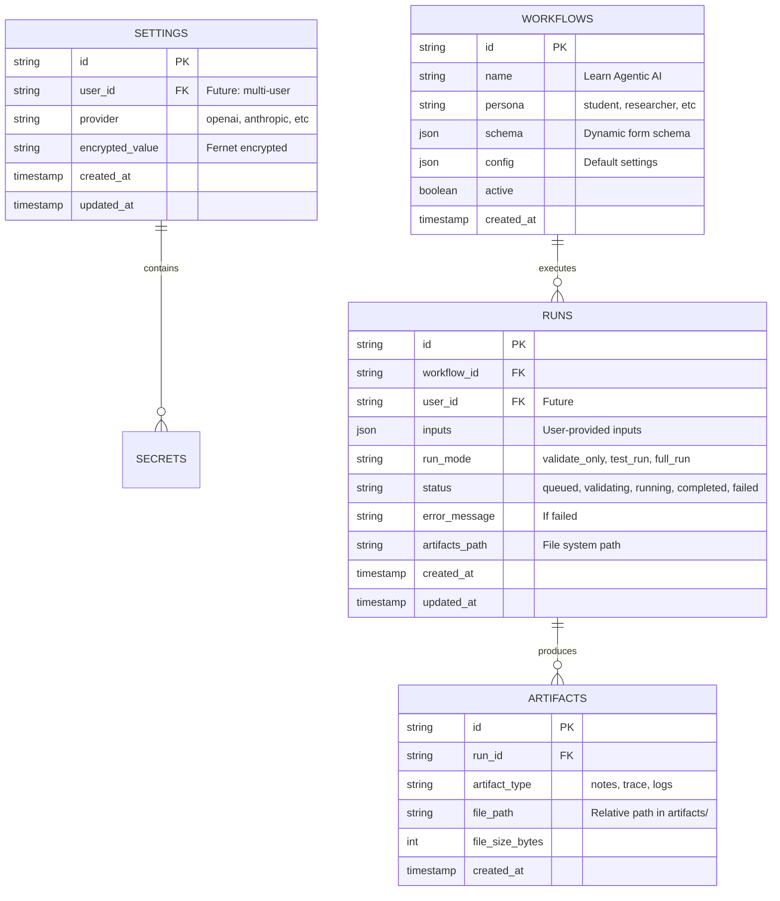

# Technical Architecture - Agentic Workflow Platform

**Document Version:** 1.0  
**Date:** February 4, 2026  
**Audience:** Engineering Team  
**Status:** Implementation Ready

---

## Technology Stack

### Frontend Stack
```yaml
Framework: Next.js 15.1.0 (App Router)
Runtime: Node.js 20 LTS
Language: TypeScript 5.x (strict mode)
UI Library: React 19
Styling: Tailwind CSS 3.4
State Management: Zustand 5.x
Form Management: React Hook Form + Zod validation
HTTP Client: Axios
Markdown Rendering: react-markdown
Icons: Lucide React
Build Tool: Turbopack (Next.js built-in)
```

### Backend Stack
```yaml
Framework: FastAPI 0.115.0
Runtime: Python 3.11
ASGI Server: Uvicorn (with uvloop)
ORM: SQLAlchemy 2.0 (async)
Database Driver: aiosqlite (SQLite async)
Validation: Pydantic 2.9
LLM SDKs:
  - openai: 1.54.4
  - anthropic: 0.39.0
  - google-generativeai: 0.8.3
HTTP Client: httpx (async)
Encryption: cryptography (Fernet)
Auth (Future): python-jose, passlib
```

### Infrastructure
```yaml
Containerization: Docker 24.x
Orchestration: Docker Compose 2.x
Database: SQLite 3 → PostgreSQL (future)
File Storage: Local FS → S3 (future)
Queue (Future): Celery + Redis
Monitoring (Future): Prometheus + Grafana
Logging: Structured JSON logs
```

---

## Backend Component Architecture

```mermaid
graph TB
    subgraph "API Layer (src/api/)"
        Settings[settings.py<br/>Settings Endpoints]
        Workflows[workflows.py<br/>Workflow Endpoints]
        Runs[runs.py<br/>Run Endpoints]
        Health[health.py<br/>Health Checks]
    end

    subgraph "Service Layer (src/services/)"
        SettingsSvc[settings_service.py<br/>Secret Management Logic]
        WorkflowSvc[workflow_service.py<br/>Catalog & Schema Logic]
        RunSvc[run_service.py<br/>Execution Orchestration]
        ValidationSvc[validation_service.py<br/>Preflight Validation]
    end

    subgraph "Domain Layer (src/workflows/)"
        WorkflowDef[workflow_definitions.py<br/>Workflow Specifications]
        WorkflowEngine[workflow_engine.py<br/>Execution State Machine]
        RunModes[run_modes.py<br/>Validate/Test/Full Logic]
    end

    subgraph "Provider Layer (src/providers/)"
        BaseProvider[base_provider.py<br/>LLMProvider Protocol]
        OpenAIAdapter[openai_adapter.py]
        AnthropicAdapter[anthropic_adapter.py]
        GeminiAdapter[gemini_adapter.py]
        DeepSeekAdapter[deepseek_adapter.py]
        ProviderFactory[provider_factory.py<br/>Strategy Pattern]
    end

    subgraph "Data Layer (src/db/)"
        Database[database.py<br/>Session Management]
        Models[models.py<br/>SQLAlchemy Models]
        Repos[repositories/<br/>Repository Pattern]
    end

    subgraph "Cross-Cutting (src/core/)"
        Config[config.py<br/>Settings Management]
        Security[security.py<br/>Encryption, Hashing]
        Logger[logger.py<br/>Structured Logging]
        Exceptions[exceptions.py<br/>Custom Exceptions]
    end

    Settings --> SettingsSvc
    Workflows --> WorkflowSvc
    Runs --> RunSvc

    SettingsSvc --> Security
    SettingsSvc --> Repos

    WorkflowSvc --> WorkflowDef
    WorkflowSvc --> Repos

    RunSvc --> WorkflowEngine
    RunSvc --> ValidationSvc
    RunSvc --> Repos

    WorkflowEngine --> RunModes
    WorkflowEngine --> ProviderFactory

    ProviderFactory --> OpenAIAdapter
    ProviderFactory --> AnthropicAdapter
    ProviderFactory --> GeminiAdapter
    ProviderFactory --> DeepSeekAdapter

    OpenAIAdapter --> BaseProvider
    AnthropicAdapter --> BaseProvider
    GeminiAdapter --> BaseProvider
    DeepSeekAdapter --> BaseProvider

    Repos --> Database
    Database --> Models

    style Settings fill:#FF6B6B
    style SettingsSvc fill:#4ECDC4
    style WorkflowEngine fill:#95E1D3
    style BaseProvider fill:#F38181
    style Database fill:#AA96DA
```



---

## Detailed Component Specifications

### 1. API Layer (REST Controllers)

**Responsibility:** HTTP request handling, input validation, response formatting

**Pattern:** Controller → Service → Repository

```python
# src/api/runs.py
from fastapi import APIRouter, Depends, HTTPException
from src.services.run_service import RunService
from src.models.schemas import CreateRunRequest, RunResponse

router = APIRouter()

@router.post("/runs", response_model=RunResponse, status_code=201)
async def create_run(
    request: CreateRunRequest,
    run_service: RunService = Depends(get_run_service)
):
    """
    Create and start a new workflow run.
    Validates inputs, enforces run mode, returns run_id immediately.
    """
    try:
        run = await run_service.create_and_execute(request)
        return RunResponse.from_orm(run)
    except ValidationError as e:
        raise HTTPException(status_code=400, detail=str(e))
    except ProviderError as e:
        raise HTTPException(status_code=502, detail=f"Provider error: {str(e)}")
```

**Design Decisions:**
- **Dependency Injection**: Services injected via `Depends()` for testability
- **Pydantic Models**: Automatic validation, serialization, OpenAPI docs
- **Status Codes**: RESTful (201 for create, 400 for validation, 502 for provider errors)
- **Error Handling**: Custom exceptions mapped to HTTP status codes

---

### 2. Service Layer (Business Logic)

**Responsibility:** Orchestration, business rules, transaction management

**Pattern:** Service facade, transaction boundaries

```python
# src/services/run_service.py
from src.db.repositories import RunRepository, SettingsRepository
from src.workflows.workflow_engine import WorkflowEngine
from src.core.exceptions import ValidationError, ProviderError

class RunService:
    def __init__(
        self,
        run_repo: RunRepository,
        settings_repo: SettingsRepository,
        workflow_engine: WorkflowEngine
    ):
        self.run_repo = run_repo
        self.settings_repo = settings_repo
        self.workflow_engine = workflow_engine

    async def create_and_execute(self, request: CreateRunRequest) -> Run:
        """
        Orchestrate run creation and execution.
        Transaction boundary: DB write + async execution start.
        """
        # 1. Validate workflow exists
        workflow = await self.workflow_service.get_workflow(request.workflow_id)
        if not workflow:
            raise ValidationError(f"Workflow {request.workflow_id} not found")

        # 2. Create run record (status: queued)
        run = await self.run_repo.create(
            workflow_id=request.workflow_id,
            inputs=request.inputs,
            run_mode=request.run_mode,
            status=RunStatus.QUEUED
        )

        # 3. Start async execution (non-blocking)
        asyncio.create_task(self._execute_run(run.id))

        return run

    async def _execute_run(self, run_id: str):
        """
        Execute run with error handling.
        Updates DB status throughout lifecycle.
        """
        try:
            # Update status: validating
            await self.run_repo.update_status(run_id, RunStatus.VALIDATING)

            # Phase 1: Validate-Only (always)
            validation_result = await self.workflow_engine.validate(run_id)
            if not validation_result.success:
                await self.run_repo.update_status(run_id, RunStatus.FAILED)
                return

            # Phase 2: Execute based on run mode
            await self.run_repo.update_status(run_id, RunStatus.RUNNING)
            result = await self.workflow_engine.execute(run_id)

            # Update final status
            await self.run_repo.update_status(run_id, RunStatus.COMPLETED)

        except Exception as e:
            logger.error(f"Run {run_id} failed", exc_info=True)
            await self.run_repo.update_status(run_id, RunStatus.FAILED, error=str(e))
```

**Design Decisions:**
- **Async Task**: `create_task()` for non-blocking execution
- **Status State Machine**: Queued → Validating → Running → Completed/Failed
- **Transaction Safety**: Run creation committed before async execution
- **Error Recovery**: All exceptions caught, status updated

---

### 3. Workflow Engine (Domain Logic)

**Responsibility:** Workflow execution, run mode enforcement, artifact generation

**Pattern:** State machine, strategy pattern for run modes

```python
# src/workflows/workflow_engine.py
from src.workflows.run_modes import ValidateOnly, TestRun, FullRun
from src.providers.provider_factory import ProviderFactory

class WorkflowEngine:
    def __init__(self, provider_factory: ProviderFactory):
        self.provider_factory = provider_factory
        self.run_modes = {
            RunMode.VALIDATE_ONLY: ValidateOnly(),
            RunMode.TEST_RUN: TestRun(),
            RunMode.FULL_RUN: FullRun()
        }

    async def validate(self, run_id: str) -> ValidationResult:
        """
        Preflight validation (always runs first).
        - Check secret availability
        - Test provider connection (minimal call)
        - Validate input schema
        """
        run = await self.run_repo.get(run_id)
        validator = self.run_modes[RunMode.VALIDATE_ONLY]
        
        return await validator.execute(
            workflow=run.workflow,
            inputs=run.inputs,
            provider=self.provider_factory.get_provider(run.provider)
        )

    async def execute(self, run_id: str) -> ExecutionResult:
        """
        Execute workflow based on run mode.
        Applies mode-specific caps (tokens, runtime, iterations).
        """
        run = await self.run_repo.get(run_id)
        executor = self.run_modes[run.run_mode]

        result = await executor.execute(
            workflow=run.workflow,
            inputs=run.inputs,
            provider=self.provider_factory.get_provider(run.provider)
        )

        # Write artifacts
        await self._write_artifacts(run_id, result)

        return result
```

**Run Mode Strategy Pattern:**

```python
# src/workflows/run_modes.py
from abc import ABC, abstractmethod

class RunModeStrategy(ABC):
    @abstractmethod
    async def execute(self, workflow, inputs, provider) -> ExecutionResult:
        pass

class ValidateOnly(RunModeStrategy):
    async def execute(self, workflow, inputs, provider):
        """Dry run: check configs, test connection, no actual execution"""
        # Test provider connection with minimal call
        await provider.health_check()
        # Validate input schema
        workflow.validate_inputs(inputs)
        return ValidationResult(success=True)

class TestRun(RunModeStrategy):
    MAX_TOKENS = 1000
    MAX_RUNTIME = 60  # seconds
    MAX_ITERATIONS = 5

    async def execute(self, workflow, inputs, provider):
        """Smoke run with strict caps"""
        return await workflow.execute(
            inputs=inputs,
            provider=provider,
            max_tokens=self.MAX_TOKENS,
            max_runtime=self.MAX_RUNTIME,
            max_iterations=self.MAX_ITERATIONS
        )

class FullRun(RunModeStrategy):
    async def execute(self, workflow, inputs, provider):
        """Full execution (no caps)"""
        return await workflow.execute(inputs=inputs, provider=provider)
```

---

### 4. Provider Adapter Layer

**Responsibility:** Unified LLM interface, rate limiting, error handling

**Pattern:** Adapter pattern, protocol-based (duck typing)

```python
# src/providers/base_provider.py
from typing import Protocol, List, Dict, Any
from src.models.schemas import Message, ToolCall, CompletionResponse

class LLMProvider(Protocol):
    """
    Protocol defining unified LLM interface.
    All providers must implement these methods.
    """
    async def health_check(self) -> bool:
        """Test provider connection (minimal call)"""
        ...

    async def complete(
        self,
        messages: List[Message],
        max_tokens: int | None = None,
        temperature: float = 0.7,
        tools: List[ToolCall] | None = None
    ) -> CompletionResponse:
        """Generate completion with optional tool calls"""
        ...

    async def stream_complete(
        self,
        messages: List[Message],
        **kwargs
    ) -> AsyncIterator[str]:
        """Stream completion tokens (future feature)"""
        ...


# src/providers/openai_adapter.py
import openai
from src.providers.base_provider import LLMProvider

class OpenAIAdapter:
    def __init__(self, api_key: str):
        self.client = openai.AsyncOpenAI(api_key=api_key)

    async def health_check(self) -> bool:
        try:
            await self.client.models.list()
            return True
        except openai.APIError:
            return False

    async def complete(
        self,
        messages: List[Message],
        max_tokens: int | None = None,
        temperature: float = 0.7,
        tools: List[ToolCall] | None = None
    ) -> CompletionResponse:
        """Translate to OpenAI format"""
        response = await self.client.chat.completions.create(
            model="gpt-4-turbo-preview",
            messages=[m.dict() for m in messages],
            max_tokens=max_tokens,
            temperature=temperature,
            tools=[t.dict() for t in tools] if tools else None
        )
        return CompletionResponse.from_openai(response)


# src/providers/provider_factory.py
class ProviderFactory:
    def __init__(self, settings_repo: SettingsRepository):
        self.settings_repo = settings_repo

    async def get_provider(self, provider_name: str) -> LLMProvider:
        """
        Factory method: resolve provider and return adapter.
        Decrypts secrets on-demand.
        """
        secret = await self.settings_repo.get_secret(provider_name)
        
        if provider_name == "openai":
            return OpenAIAdapter(api_key=secret)
        elif provider_name == "anthropic":
            return AnthropicAdapter(api_key=secret)
        elif provider_name == "gemini":
            return GeminiAdapter(api_key=secret)
        elif provider_name == "deepseek":
            return DeepSeekAdapter(api_key=secret, base_url="https://api.deepseek.com")
        else:
            raise ValueError(f"Unknown provider: {provider_name}")
```

**Design Decisions:**
- **Protocol over ABC**: More Pythonic, supports structural subtyping
- **Adapter Isolation**: Provider-specific logic encapsulated
- **Factory Pattern**: Centralized provider instantiation
- **Lazy Loading**: Secrets decrypted only when provider needed

---

### 5. Data Layer (Repository Pattern)

**Responsibility:** Data access abstraction, query encapsulation

**Pattern:** Repository per aggregate root

```python
# src/db/models.py (SQLAlchemy ORM)
from sqlalchemy import Column, String, JSON, DateTime, Enum
from sqlalchemy.orm import relationship
from src.db.database import Base
import uuid
from datetime import datetime

class Run(Base):
    __tablename__ = "runs"

    id = Column(String, primary_key=True, default=lambda: str(uuid.uuid4()))
    workflow_id = Column(String, nullable=False)
    user_id = Column(String, nullable=True)  # Future: multi-user
    inputs = Column(JSON, nullable=False)
    run_mode = Column(Enum(RunMode), nullable=False)
    status = Column(Enum(RunStatus), nullable=False)
    error_message = Column(String, nullable=True)
    artifacts_path = Column(String, nullable=True)
    created_at = Column(DateTime, default=datetime.utcnow)
    updated_at = Column(DateTime, default=datetime.utcnow, onupdate=datetime.utcnow)

    # Relationships (future)
    # workflow = relationship("Workflow", back_populates="runs")


# src/db/repositories/run_repository.py
from sqlalchemy.ext.asyncio import AsyncSession
from sqlalchemy import select
from src.db.models import Run

class RunRepository:
    def __init__(self, session: AsyncSession):
        self.session = session

    async def create(self, **kwargs) -> Run:
        """Create new run record"""
        run = Run(**kwargs)
        self.session.add(run)
        await self.session.commit()
        await self.session.refresh(run)
        return run

    async def get(self, run_id: str) -> Run | None:
        """Get run by ID"""
        result = await self.session.execute(
            select(Run).where(Run.id == run_id)
        )
        return result.scalar_one_or_none()

    async def update_status(
        self,
        run_id: str,
        status: RunStatus,
        error: str | None = None
    ):
        """Update run status (state machine transition)"""
        run = await self.get(run_id)
        if run:
            run.status = status
            if error:
                run.error_message = error
            await self.session.commit()

    async def list_by_user(self, user_id: str, limit: int = 50) -> List[Run]:
        """List user's runs (paginated)"""
        result = await self.session.execute(
            select(Run)
            .where(Run.user_id == user_id)
            .order_by(Run.created_at.desc())
            .limit(limit)
        )
        return result.scalars().all()
```

**Design Decisions:**
- **Repository Isolation**: DB queries encapsulated, easier testing
- **Async All The Way**: No blocking I/O in async context
- **UUID Primary Keys**: Distributed-friendly, no collisions
- **Timestamps**: Auto-managed created_at/updated_at
- **JSON Column**: Flexible inputs storage (schema in Pydantic)

---

### 6. Security Layer

**Responsibility:** Encryption, secret management, audit logging

```python
# src/core/security.py
from cryptography.fernet import Fernet
import os
import base64

class SecretManager:
    def __init__(self):
        # Load encryption key from env (32-byte key for Fernet)
        key = os.getenv("SECRET_KEY")
        if not key:
            raise ValueError("SECRET_KEY not set in environment")
        self.cipher = Fernet(base64.urlsafe_b64encode(key.encode()[:32].ljust(32)))

    def encrypt(self, plaintext: str) -> str:
        """Encrypt secret (returns base64 string)"""
        return self.cipher.encrypt(plaintext.encode()).decode()

    def decrypt(self, ciphertext: str) -> str:
        """Decrypt secret"""
        return self.cipher.decrypt(ciphertext.encode()).decode()


# src/db/repositories/settings_repository.py
class SettingsRepository:
    def __init__(self, session: AsyncSession, secret_manager: SecretManager):
        self.session = session
        self.secret_manager = secret_manager

    async def store_secret(self, provider: str, api_key: str):
        """Store encrypted API key"""
        encrypted = self.secret_manager.encrypt(api_key)
        
        setting = await self.get_or_create(provider=provider)
        setting.encrypted_value = encrypted
        setting.updated_at = datetime.utcnow()
        
        await self.session.commit()
        
        # Audit log (never log plaintext)
        logger.info(f"Secret updated", extra={
            "provider": provider,
            "action": "secret_update",
            "user_id": "system"  # Future: actual user
        })

    async def get_secret(self, provider: str) -> str | None:
        """Retrieve and decrypt API key"""
        setting = await self.get(provider=provider)
        if not setting or not setting.encrypted_value:
            return None
        
        return self.secret_manager.decrypt(setting.encrypted_value)
```

---

## Frontend Component Architecture

```mermaid
graph TB
    subgraph "Pages (src/app/)"
        Home[page.tsx<br/>Landing/Dashboard]
        Settings[settings/page.tsx<br/>Provider Configuration]
        Catalog[workflows/page.tsx<br/>Workflow Catalog]
        Runner[workflows/[id]/page.tsx<br/>Workflow Runner]
        Results[runs/[id]/page.tsx<br/>Run Results]
    end

    subgraph "Components (src/components/)"
        Layout[Layout.tsx<br/>Shell, Nav]
        WorkflowCard[WorkflowCard.tsx]
        DynamicForm[DynamicForm.tsx<br/>Schema-Driven]
        RunStatus[RunStatusBadge.tsx]
        ArtifactViewer[ArtifactViewer.tsx]
    end

    subgraph "State Management (src/lib/)"
        API[api-client.ts<br/>Axios Instance]
        SettingsStore[stores/settings.ts<br/>Zustand]
        WorkflowsStore[stores/workflows.ts<br/>Zustand]
        RunsStore[stores/runs.ts<br/>Zustand]
    end

    subgraph "Utilities"
        Types[types.ts<br/>TypeScript Interfaces]
        Validators[validators.ts<br/>Zod Schemas]
        Utils[utils.ts<br/>Helpers]
    end

    Home --> Layout
    Settings --> Layout
    Catalog --> Layout
    Runner --> Layout
    Results --> Layout

    Catalog --> WorkflowCard
    Runner --> DynamicForm
    Results --> RunStatus
    Results --> ArtifactViewer

    Settings --> SettingsStore
    Catalog --> WorkflowsStore
    Runner --> WorkflowsStore
    Results --> RunsStore

    SettingsStore --> API
    WorkflowsStore --> API
    RunsStore --> API

    DynamicForm --> Validators
    API --> Types

    style Home fill:#61DAFB
    style DynamicForm fill:#95E1D3
    style API fill:#F38181
```

**Key Frontend Patterns:**
- **Server Components**: Default for data fetching (performance)
- **Client Components**: Interactive forms, state management
- **Dynamic Form Generation**: JSON schema → React Hook Form
- **Optimistic Updates**: Immediate UI feedback, background sync
- **Error Boundaries**: Graceful error handling per route

---

## Database Schema



**Indexes (Performance):**
```sql
CREATE INDEX idx_runs_workflow_id ON runs(workflow_id);
CREATE INDEX idx_runs_user_id ON runs(user_id);
CREATE INDEX idx_runs_status ON runs(status);
CREATE INDEX idx_runs_created_at ON runs(created_at DESC);
CREATE INDEX idx_artifacts_run_id ON artifacts(run_id);
```

---

## API Contract (OpenAPI Summary)

### Core Endpoints

**Settings**
- `GET /settings/providers` - List supported providers
- `POST /settings/secrets` - Store API key (encrypted)
- `GET /settings/secrets/status` - Connection status per provider
- `DELETE /settings/secrets/{provider}` - Remove API key

**Workflows**
- `GET /workflows` - List workflows (filter by persona)
- `GET /workflows/{id}` - Get workflow details
- `GET /workflows/{id}/schema` - Get dynamic form schema

**Runs**
- `POST /runs` - Create and start run
- `GET /runs/{id}` - Get run status and results
- `GET /runs` - List user's runs (paginated)
- `GET /runs/{id}/artifacts` - Download artifacts (zip)
- `POST /runs/{id}/cancel` - Cancel running workflow (future)

**Full OpenAPI spec auto-generated by FastAPI at `/docs`**

---

## Testing Strategy

### Unit Tests
```
src/
  services/
    tests/
      test_run_service.py      # Mock repositories
  providers/
    tests/
      test_openai_adapter.py   # Mock API responses
  workflows/
    tests/
      test_workflow_engine.py  # Mock providers
```

### Integration Tests
```
tests/
  integration/
    test_api_endpoints.py      # TestClient + test DB
    test_workflow_execution.py # End-to-end with mock LLM
```

### E2E Tests (Future)
```
tests/
  e2e/
    test_user_journey.py       # Playwright
```

**Tools:**
- `pytest` + `pytest-asyncio`
- `pytest-cov` for coverage (target 80%+)
- `httpx.AsyncClient` for API tests
- `factory_boy` for test data

---

## Performance Considerations

### Async Architecture
- **All I/O async**: No blocking calls (database, LLM, file system)
- **Connection pooling**: SQLAlchemy pool for DB, httpx for providers
- **Timeouts**: Configurable per run mode (Test-Run: 60s, Full-Run: 10min)

### Caching Strategy (Future)
```python
# Redis caching for workflow schemas (rarely change)
@cache(ttl=3600)
async def get_workflow_schema(workflow_id: str):
    ...

# Run status caching (5-second TTL during execution)
@cache(ttl=5)
async def get_run_status(run_id: str):
    ...
```

### Rate Limiting (Provider Protection)
```python
# Per-provider rate limiter
rate_limiter = RateLimiter(
    calls=10,         # 10 requests
    period=1.0,       # per second
    per_api_key=True  # per secret
)
```

---

## Migration Paths

### SQLite → PostgreSQL
1. Update `DATABASE_URL` env var
2. Install `asyncpg` driver
3. Run same SQLAlchemy models (zero code change)
4. Add connection pooling config

### In-Process → Celery Queue
1. Implement `CeleryExecutionBackend` (same interface)
2. Move `_execute_run()` to Celery task
3. Update `RunService` to enqueue instead of `create_task()`
4. Add Redis for task queue

### Local FS → S3
1. Implement `S3ArtifactStorage` (same interface as `LocalArtifactStorage`)
2. Update config to use S3 backend
3. Migrate existing artifacts with script

---

## Observability (Future)

### Structured Logging
```python
logger.info(
    "Workflow execution started",
    extra={
        "run_id": run.id,
        "workflow_id": run.workflow_id,
        "run_mode": run.run_mode.value,
        "user_id": run.user_id,
        "provider": run.provider
    }
)
```

### Metrics (Prometheus)
- `workflow_runs_total{status, workflow_id, run_mode}`
- `workflow_duration_seconds{workflow_id, run_mode}`
- `provider_api_calls_total{provider, status}`
- `provider_api_latency_seconds{provider}`

### Tracing (OpenTelemetry)
- Trace run execution across service boundaries
- Correlate logs/metrics with trace IDs

---

## Security Checklist

- [x] API keys encrypted at rest (Fernet)
- [x] Secrets never sent to browser
- [x] All LLM calls proxied through backend
- [x] Input validation (Pydantic)
- [x] SQL injection protected (SQLAlchemy ORM)
- [ ] Rate limiting per user (future)
- [ ] RBAC for multi-user (future)
- [ ] Audit logging all secret access
- [ ] HTTPS enforced in production
- [ ] CORS restricted to frontend origin
- [ ] CSP headers (Next.js)
- [ ] Dependency scanning (Dependabot)

---

## Next Steps

1. ✅ Review & approve technical architecture
2. → Implement database models + repositories
3. → Implement provider adapters
4. → Implement workflow engine
5. → Build API endpoints
6. → Build frontend pages
7. → Integration testing
8. → Docker deployment testing

---

**Reviewed By:** _[Pending]_  
**Date:** _[Pending]_
