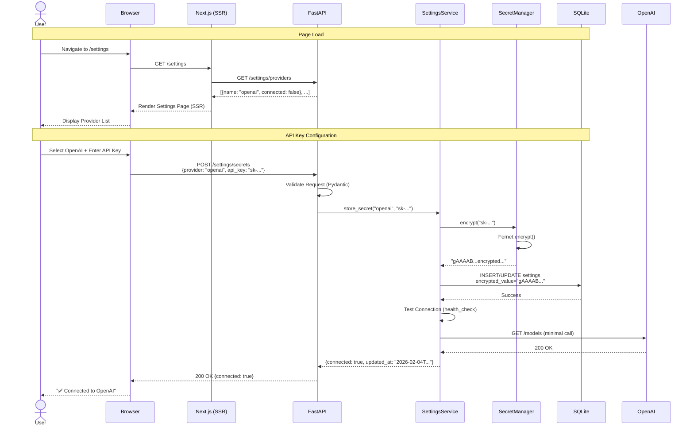
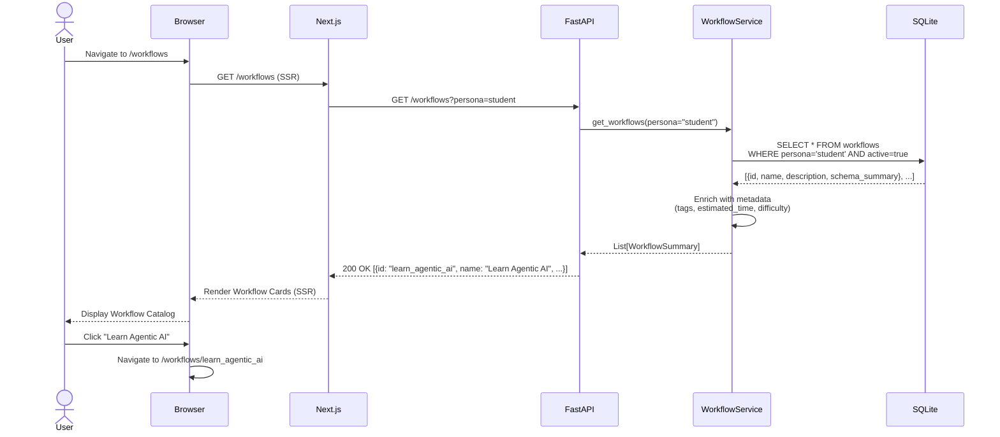
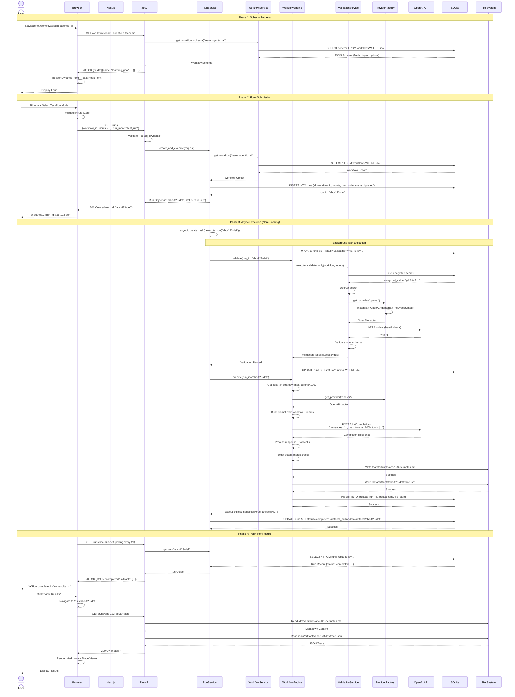
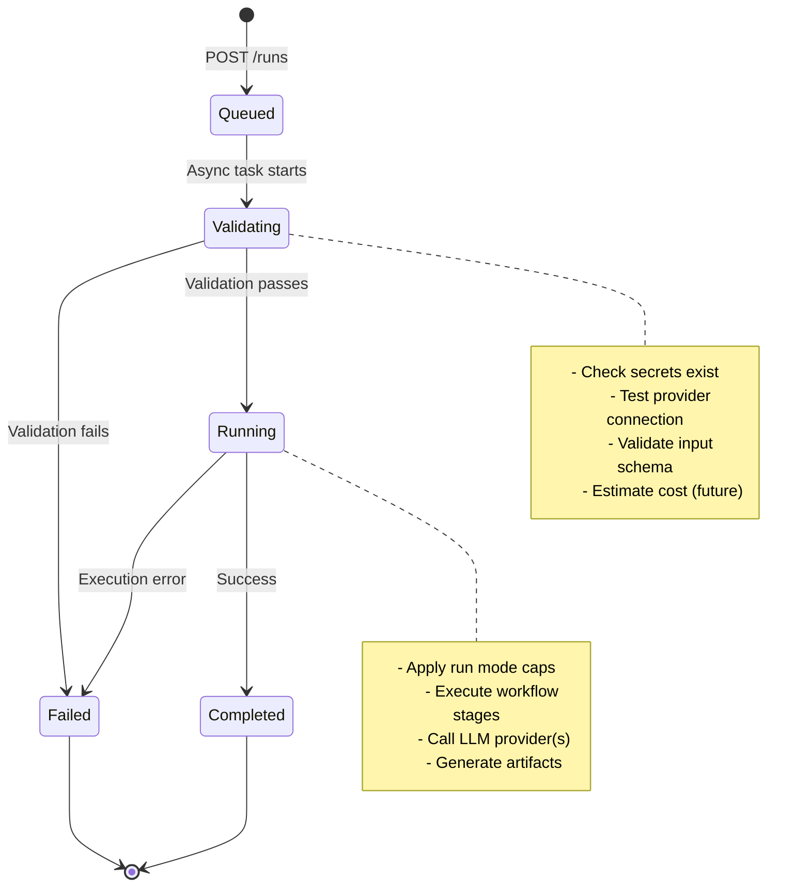
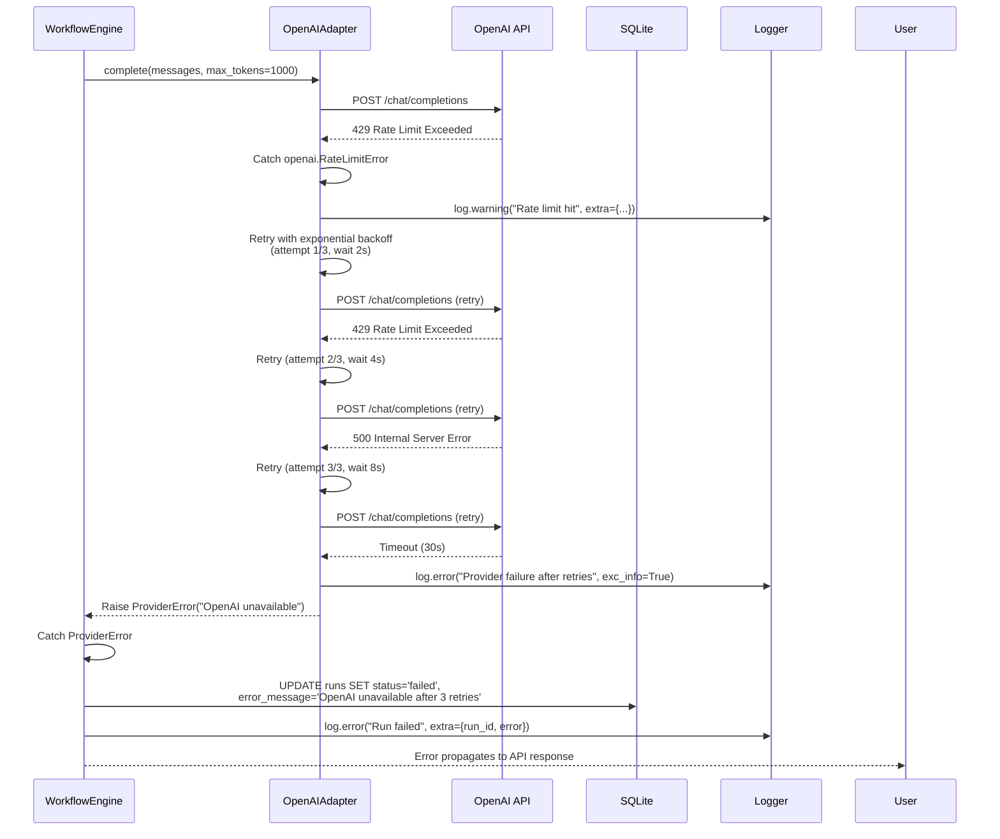

# Data Flow Architecture - Agentic Workflow Platform

**Document Version:** 1.0  
**Date:** February 4, 2026  
**Purpose:** Request/response lifecycles, state transitions, data transformations

---

## 1. Settings Configuration Flow

### User Story: Configure OpenAI Provider



**Data Transformations:**

| Stage | Format | Example |
|-------|--------|---------|
| **User Input** | Plain text | `sk-1234567890abcdef` |
| **API Request** | JSON | `{"provider": "openai", "api_key": "sk-..."}` |
| **Validated** | Pydantic Model | `SecretRequest(provider=Provider.OPENAI, api_key=SecretStr(...))` |
| **Encrypted** | Base64 Fernet | `gAAAABfK7...` (160 chars) |
| **Stored** | SQLite TEXT | `encrypted_value` column |
| **Retrieved** | Decrypted str | `sk-1234567890abcdef` (in memory only) |
| **API Response** | JSON (status only) | `{"connected": true}` (never exposes key) |

**Security Boundaries:**
- 🔒 **Browser → API**: HTTPS only, key transmitted once
- 🔒 **API → DB**: Encrypted at rest (Fernet symmetric)
- 🔒 **DB → Memory**: Decrypted on-demand, never logged
- 🔒 **API → Browser**: Connection status only, no secrets

---

## 2. Workflow Discovery Flow

### User Story: Browse Available Workflows



**Data Transformations:**

```
Database Record (SQLite)
  ↓
WorkflowModel (SQLAlchemy ORM)
  ↓
WorkflowSummary (Pydantic)
  ↓
JSON Response
  ↓
TypeScript WorkflowCard Props
  ↓
React Component Render
```

---

## 3. Workflow Execution Flow (Core)

### User Story: Execute "Learn Agentic AI" in Test-Run Mode



---

## 4. Run State Machine

### Run Status Lifecycle



**Status Descriptions:**

| Status | Description | User Action | Duration |
|--------|-------------|-------------|----------|
| **Queued** | Run created, awaiting execution | Wait | <1s |
| **Validating** | Preflight checks running | Wait | 2-5s |
| **Running** | Workflow executing | Wait | 30s-10min |
| **Completed** | Success, artifacts available | View results | Final |
| **Failed** | Error occurred, check logs | Retry / debug | Final |

---

## 5. Data Persistence Strategy

### Write Patterns

**Database (SQLite/PostgreSQL):**
```
┌──────────────────────────────────────┐
│ Metadata (fast queries)              │
├──────────────────────────────────────┤
│ • Run status, timestamps             │
│ • User settings (encrypted secrets)  │
│ • Workflow definitions               │
│ • Artifact metadata (paths, sizes)   │
└──────────────────────────────────────┘
```

**File System (Artifacts):**
```
/data/artifacts/
├── {run_id}/
│   ├── notes.md         ← Workflow output
│   ├── trace.json       ← Execution trace
│   ├── logs.txt         ← Debug logs
│   └── metadata.json    ← Run config
```

**Why Split Storage?**
- **DB**: Fast queries, indexing, relational data
- **FS**: Large text files, easier export, cheaper storage
- **Migration**: FS → S3 later without DB schema changes

---

## 6. Error Handling Flow

### Scenario: Provider API Failure During Execution



**Error Categories:**

| Error Type | HTTP Status | Retry? | User Message |
|------------|-------------|--------|--------------|
| **ValidationError** | 400 | No | "Invalid input: {details}" |
| **ProviderError** | 502 | Yes (3x) | "Provider unavailable, try again later" |
| **RateLimitError** | 429 | Yes (backoff) | "Rate limit exceeded, retrying..." |
| **TimeoutError** | 504 | Yes (1x) | "Request timed out, try Test-Run mode" |
| **InternalError** | 500 | No | "Internal error, contact support" |

---

## 7. Frontend State Management

### Zustand Store Architecture

```typescript
// src/lib/stores/runs.ts
interface RunsState {
  // State
  runs: Record<string, Run>;
  currentRunId: string | null;
  pollingIntervals: Record<string, NodeJS.Timeout>;

  // Actions
  createRun: (request: CreateRunRequest) => Promise<string>;
  fetchRun: (runId: string) => Promise<void>;
  startPolling: (runId: string) => void;
  stopPolling: (runId: string) => void;
}

const useRunsStore = create<RunsState>((set, get) => ({
  runs: {},
  currentRunId: null,
  pollingIntervals: {},

  createRun: async (request) => {
    const response = await api.post('/runs', request);
    const run = response.data;
    
    set((state) => ({
      runs: { ...state.runs, [run.id]: run },
      currentRunId: run.id
    }));
    
    // Start polling for status
    get().startPolling(run.id);
    
    return run.id;
  },

  fetchRun: async (runId) => {
    const response = await api.get(`/runs/${runId}`);
    const run = response.data;
    
    set((state) => ({
      runs: { ...state.runs, [runId]: run }
    }));
    
    // Stop polling if terminal status
    if (['completed', 'failed'].includes(run.status)) {
      get().stopPolling(runId);
    }
  },

  startPolling: (runId) => {
    const interval = setInterval(() => {
      get().fetchRun(runId);
    }, 2000); // Poll every 2s
    
    set((state) => ({
      pollingIntervals: { ...state.pollingIntervals, [runId]: interval }
    }));
  },

  stopPolling: (runId) => {
    const interval = get().pollingIntervals[runId];
    if (interval) {
      clearInterval(interval);
      set((state) => {
        const { [runId]: _, ...rest } = state.pollingIntervals;
        return { pollingIntervals: rest };
      });
    }
  }
}));
```

**Data Flow:**
```
User Action (Submit Form)
  ↓
Zustand Action (createRun)
  ↓
API Call (POST /runs)
  ↓
Optimistic Update (add to runs map)
  ↓
Start Polling (every 2s)
  ↓
Update State (on each poll)
  ↓
Stop Polling (on completed/failed)
  ↓
Component Re-render (useRunsStore)
```

---

## 8. Performance Optimizations

### Async Patterns

**Parallel Execution:**
```python
# Bad: Sequential (slow)
await validate_secrets()
await validate_schema()
await test_connection()

# Good: Parallel (fast)
await asyncio.gather(
    validate_secrets(),
    validate_schema(),
    test_connection()
)
```

**Connection Pooling:**
```python
# SQLAlchemy pool settings
engine = create_async_engine(
    DATABASE_URL,
    pool_size=20,          # Max connections
    max_overflow=10,       # Additional connections
    pool_pre_ping=True,    # Test connection before use
    pool_recycle=3600      # Recycle after 1 hour
)

# httpx client pooling
provider_client = httpx.AsyncClient(
    limits=httpx.Limits(
        max_connections=100,
        max_keepalive_connections=20
    ),
    timeout=30.0
)
```

**Streaming Response (Future):**
```python
@router.get("/runs/{run_id}/stream")
async def stream_run_output(run_id: str):
    """Stream workflow output in real-time"""
    async def generate():
        async for chunk in workflow_engine.stream_execute(run_id):
            yield f"data: {json.dumps(chunk)}\n\n"
    
    return StreamingResponse(generate(), media_type="text/event-stream")
```

---

## 9. Scalability Considerations

### Current (MVP): Single-Node

```
┌─────────────────────────────────┐
│  Docker Compose                 │
│  ┌─────────┐    ┌────────────┐ │
│  │ Next.js │    │  FastAPI   │ │
│  │  :3000  │───▶│   :8000    │ │
│  └─────────┘    └────────────┘ │
│                      │          │
│                      ▼          │
│                 ┌────────┐      │
│                 │ SQLite │      │
│                 └────────┘      │
└─────────────────────────────────┘
```

### Future: Distributed

```
┌──────────────┐
│ Load Balancer│
└──┬────────┬──┘
   │        │
   ▼        ▼
┌──────┐ ┌──────┐
│ Web 1│ │ Web 2│  (Next.js, horizontal scale)
└──┬───┘ └───┬──┘
   │         │
   └────┬────┘
        ▼
┌───────────────┐
│ API Gateway   │
└──┬────────┬───┘
   │        │
   ▼        ▼
┌──────┐ ┌──────┐
│ API 1│ │ API 2│  (FastAPI, horizontal scale)
└──┬───┘ └───┬──┘
   │         │
   └────┬────┘
        ▼
┌───────────────┐
│ Redis Queue   │  (Celery tasks)
└───────┬───────┘
        │
   ┌────┴────┐
   ▼         ▼
┌────────┐ ┌────────┐
│Worker 1│ │Worker 2│  (Workflow execution)
└────────┘ └────────┘
   │         │
   └────┬────┘
        ▼
┌──────────────┐
│ PostgreSQL   │  (Replicated)
└──────────────┘
   │
   ▼
┌──────────────┐
│  S3 Storage  │  (Artifacts)
└──────────────┘
```

---

## Summary: Critical Data Paths

1. **Secret Storage**: Browser → API → Encrypt → DB (never reverse to browser)
2. **Workflow Execution**: API → Queue → Worker → LLM → Artifacts → DB
3. **Status Polling**: Browser → API → DB (2s interval, terminates on completion)
4. **Artifact Retrieval**: Browser → API → FS (or S3) → Stream response

**Next Steps:**
→ Review data flows for security vulnerabilities  
→ Identify bottlenecks for optimization  
→ Design caching strategy for workflow schemas  

---

**Approved By:** _[Pending Review]_  
**Date:** _[Pending]_
